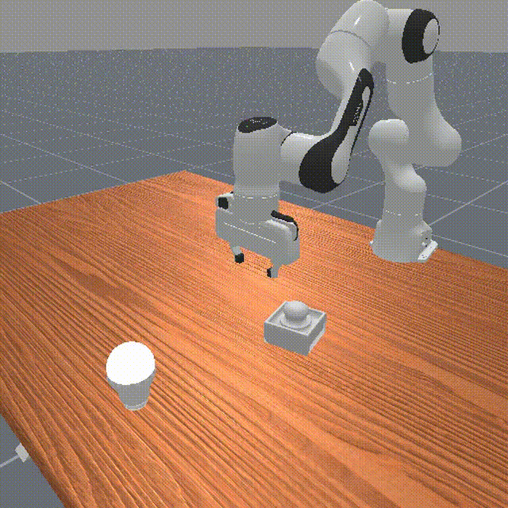
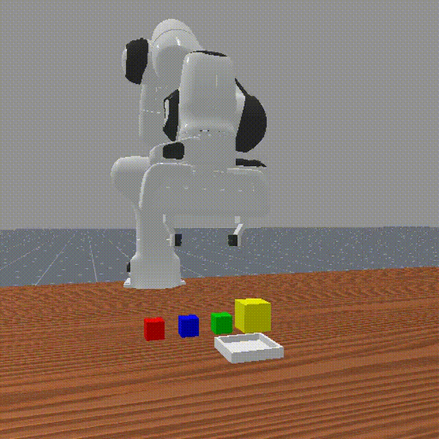
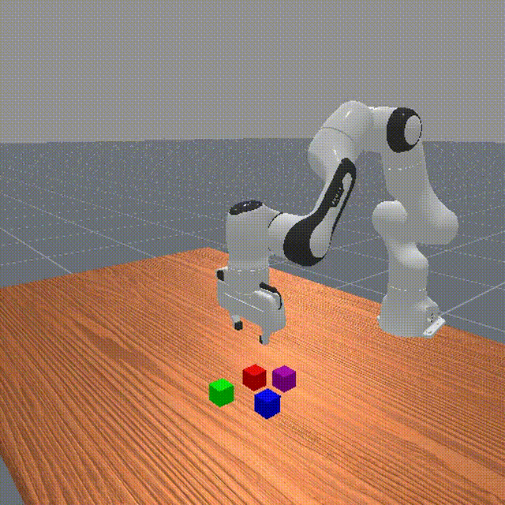
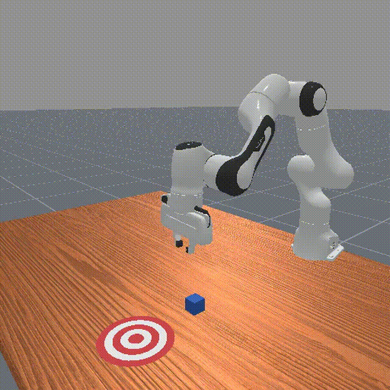
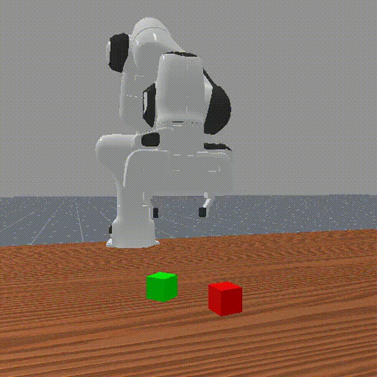

#  NEBULA: A Unified Ecosystem for Vision-Language-Action Agent Evaluation

[](TODO)
[](https://vulab-ai.github.io/NEBULA-Alpha/)
[](TODO)
[](TODO)


NEBULA is a unified ecosystem for evaluating Vision-Language-Action (VLA) agents in single-arm robotic manipulation. It is designed to move beyond coarse end-task success metrics by offering fine-grained capability tests for skill diagnosis and systematic stress tests for robustness evaluation. NEBULA promotes reproducible research through standardized APIs, structured multi-modal data, and a carefully curated task suite that spans perception, control, language, spatial reasoning, and dynamic adaptation. By focusing on what agents can do, and when they fail—NEBULA offers a principled foundation for developing robust and general-purpose embodied agents.

This is the official repository of NEBULA, featuring:
- 🗂️ A unified data platform with standardized APIs for multi-modal robotic manipulation
- 📐 A dual-axis evaluation framework combining capability testing and stress-based analysis
- 🤖 Comprehensive data collection protocols, including both scripted and human demonstrations
- 🧭 Reproducible baselines across vision, language, and control tasks

## 📰 News

- [Oct 15, 2025] Our paper has been uploaded to arXiv

- [Oct 15, 2025] NEBULA-α v1.0 has released

## ⏳ Coming Soon

The following features have been completed and are currently being prepared for public release:

- Dataset Adapters for External Sources: Plug-and-play converters for LeRobot, Mobile-ALOHA, RobotNet, and more.

- NEBULA Native Dataset on HuggingFace: Fully structured NEBULA-format episodes hosted via HuggingFace Datasets.

- Finetuned Checkpoints of Baseline Models: Finetuned weights for all official baselines to support plug-in evaluation and transfer.


## 🚪 Portals – Quick Access

Access key components of the NEBULA ecosystem below:

- 🗂️ **[Unified Data Platform](./nebula/data/dataset/README.md)**  
  Explore the structure, annotation format, and access APIs of our multi-modal dataset, including episode hierarchy, sensor modalities, and supported robots.

- 📐 **[Dual-Axis Evaluation Framework](./nebula/benchmarks/README.md)**  
  Learn about our capability tests, stress tests, evaluation metrics, and the one-line command to launch fully automated benchmarking.

- 🤖 **[Motion Planning Module](./nebula/data/generation/motionplanning/README.md)**  
  Understand how motion planning is used for data generation in structured or static scenes, and the constraints involved in planned trajectories.

- 🎮 **[Teleoperation Module](./nebula/data/generation/teleoperation/README.md)**  
  See how human demonstrations are collected via teleoperation to capture natural, adaptive behaviors in dynamic and complex scenes.

- 🎯 **[Baseline Adapter](./baselines/README.md)**  
  Access pre-configured baseline models with standardized training / fine-tuning, evaluation, and visualization scripts.

## 📦 Installation

Follow the steps below to set up NEBULA on your local machine. The installation process supports both local development and benchmark evaluation.

### Requirements
- Python 3.10 or higher

- pip>=21.0

- CUDA==12.4

### Step 1️⃣: Clone the Repository

```bash
git clone https://github.com/JerryPeng0201/NEBULA-Alpha.git

cd NEBULA-Alpha
```

### Step 2️⃣: Install Dependencies

```bash
conda create -n nebula python=3.10

conda activate nebula

# We recommend using a PyTorch version compatible with CUDA 12.4.
pip install torch==2.6.0 torchvision==0.21.0 torchaudio==2.6.0 --index-url https://download.pytorch.org/whl/cu124

pip install -r requirements.txt
```

## 🗂️ Using the Unified Data Platform

NEBULA’s data is organized in a structured and scalable format, with each episode stored as a combination of `.json` (metadata and annotations), `.h5` (sensor and trajectory signals), and `.mp4` (visual observations). For detailed schema and access examples, please refer to the [Unified Data Platform README](./nebula/data/dataset/README.md).

Importantly, NEBULA does **not** require users to collect data strictly in its native format. A key design goal of the platform is **generalizability**. We wish to support seamless integration of diverse datasets. To this end, we provide a suite of conversion adapters for many widely-used datasets, allowing users to reformat external data into NEBULA-compatible structure with minimal effort.

✅ Currently supported sources include:

**LeRobot**, **ManiSkill**, **RobotNet**, **Mobile-ALOHA**, **DROID**, **Dobbe**, **FMB**, **MimicPlay**, **RoboSet**, and **Plex RoboSuite**.

If you wish to collect your **own data** in the NEBULA format, we provide two built-in data generation modules:

- 🤖 **[Motion Planning Module](./nebula/data/generation/motionplanning/README.md)**  

- 🎮 **[Teleoperation Module](./nebula/data/generation/teleoperation/README.md)**  

This modular and extensible design makes NEBULA not only a unified platform, but also an **interoperability hub** for the broader embodied AI research community.

## 📐 Evaluation Usage Guide

NEBULA provides a dual-axis evaluation framework designed to assess both **what agents can do** (capability tests) and **how robustly they perform** (stress tests). The entire evaluation pipeline is fully automated, supporting one-line execution, JSON-based logging, and visual result generation.

To understand the structure, metrics, and definitions behind each evaluation track, please refer to the [Dual-Axis Evaluation Framework](./nebula/benchmarks/README.md).


### 🧭 Baseline Agents

We currently provide **six baseline agents** along with precomputed results and scripts for evaluation and visualization. More will be added in future releases.

📁 Baseline directory:
- [GR00T-1.5](./baselines/gr00t/README.md)
- [SpatialVLA](./baselines/SpatialVLA/README.md)
- [RDT-1B](./baselines/RDT/README.md)
- [Diffusion Policy](./baselines/DP/README.md)
- MT-ACT 🚧
- ACT 🚧
- [Customized Models](./baselines/custom/README.md)

Each folder contains:
- Training / fine-tuning scripts
- Evaluation configs (`config.yaml`)

📋 Progress:

| Baseline | Fine-tuning | Inference & Visualization | Checkpoint |
|----------|-------------|---------------------------|------------|
| GR00T-1.5 | ✅ | ✅ | 🚧 |
| SpatialVLA | ✅ | ✅ | 🚧 |
| RDT-1B | ✅ | ✅ | 🚧 |
| Diffusion Policy | ✅ | ✅ | 🚧 |
| MT-ACT | 🚧 | 🚧 | 🚧 |
| ACT | 🚧 | 🚧 | 🚧 |

**TODO**: _Fine-tuned checkpoints and more model adapters are going to be released soon._

### 📊 Comparing Multiple Models

To generate comparison plots across different models using evaluation results:

```bash
# Auto-discover and compare all models
python nebula/visualization/generate_graph_multiple.py --all

# Compare selected models explicitly
python nebula/visualization/generate_graph_multiple.py \
    --capability-jsons baselines/gr00t/results_capability_*.json baselines/RDT/results_capability_*.json \
    --stress-jsons baselines/gr00t/results_stress_*.json baselines/RDT/results_stress_*.json

# Capability-only radar chart
python nebula/visualization/generate_graph_multiple.py --all --type capability

# Stress-only bar plot
python nebula/visualization/generate_graph_multiple.py --all --type stress
```

These plots include:
- Radar charts (capability skill distribution)
- Bar plots (stress breakdown)
- Composite metrics (e.g., stability, latency, Hz)

Plase refer to [model visualization document](/nebula/visualization/README.md) for specification.

### 🎥 Simulation Video Examples

Visual examples of NEBULA tasks across various skills and difficulty levels:

<table style="border: none; border-collapse: collapse; border-spacing: 0;">
  <tr>
    <td style="border: none; padding: 0; margin: 0;">
      
    </td>
    <td style="border: none; padding: 0; margin: 0;">
      
    </td>
    <td style="border: none; padding: 0; margin: 0;">
      
    </td>
    <td style="border: none; padding: 0; margin: 0;">
      
    </td>
    <td style="border: none; padding: 0; margin: 0;">
      
    </td>
  </tr>
</table>

Whether you’re benchmarking a novel model or integrating a real-world agent, NEBULA provides a standardized, transparent, and extensible evaluation pipeline.


## 🛣️ Future Work

We are actively developing & maintaining the NEBULA ecosystem, with the following improvements planned:

- [ ] **Multi-Robot Support**: Extend beyond Franka Emika Panda to include other platforms such as UR5, xArm, Fetch, and real-world robot APIs.

- [ ] **Expanded Scenes and Task Diversity**: Introduce more environments, object sets, and task variations across perception, control, language, and spatial reasoning.

- [ ] **More Baseline Agents**: Benchmark additional vision-language-action models across both academic and industrial frameworks.

- [ ] **Richer Multi-Modal Data**: Integrate 3D sensor streams (e.g., point clouds, depth) and dynamic environmental factors (e.g., lighting, shadows, camera motion).

- [ ] **Multi-Simulator Compatibility**: Add support for additional simulators such as MuJoCo, Isaac Gym, RoboSuite, and Webots, enabling broader research integration.

- [ ] **Human-in-the-Loop Interaction Module**: Enable real-time interaction with simulated robots and support user-defined task creation, dynamic goal injection, and adaptive feedback during execution.

- [ ] **World Model-Augmented Data Generation**: Provide a fully automated pipeline for generating high-quality training data using world models. This includes environment simulation, agent rollout, annotation, and format conversion—all without manual intervention.


## 🤝 Contributing

We welcome contributions to NEBULA and are excited to collaborate with the broader research community!

There are many ways to contribute:

- 🧠 Submit bug reports or feature requests via [GitHub Issues](https://github.com/YOUR_REPO/issues)

- 🔧 Open pull requests for code improvements, adapters, or new baseline integrations

- 📦 Add support for new datasets or robots via modular adapters

- 📚 Help improve documentation and examples

- 🧭 Integrate your own Vision-Language-Action (VLA) models using our model adapter template

If you are interested in collaborating, conducting joint research, or integrating NEBULA into your own project, please feel free to reach out:

- **Dr. Yu Yin** (Assistant Professor, Case Western Reserve University): `yxy1421 at case.edu`

- **Jierui Peng** (Project Lead, Case Western Reserve University): `jxp1146 at case.edu`

We are actively building partnerships across academia and industry to expand the NEBULA ecosystem. Join us!


## 🙏 Acknowledgements

NEBULA is built on top of the excellent work from **Sapien** and [**ManiSkill3**](https://github.com/haosulab/ManiSkill/tree/main). We have leveraged their simulation infrastructure, logic, and assets throughout the development of our platform. We express our deep gratitude and sincere respect to their development teams for making such powerful tools openly available to the community.

Salute! 🫡

## 👤 Authors

**NEBULA** is developed and maintained by:

- **Jierui Peng** 

- **Yanyan Zhang** 

- **Yicheng Duan**  

- **Tuo Liang**

With guidance from:

- **Prof. Yu Yin** (Assistant Professor @ Case Western Reserve University) [*Corresponding Author*]  

- **Prof. Vipin Chaudhary** (Department Chair @ Case Western Reserve University)

## 📚 Citation

```bibtex
@article{,
  title={NEBULA: Do We Evaluate Vision-Language-Action Agents Correctly?},
  author={},
  journal={},
  year={2025}
}
```