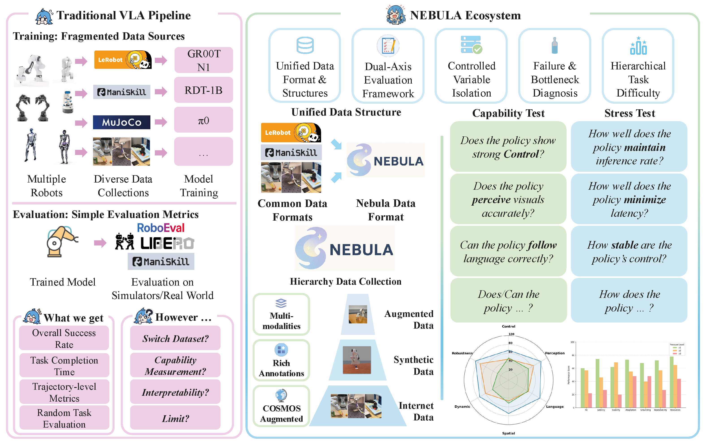

#  NEBULA: A Unified Ecosystem for Vision-Language-Action Agent Evaluation

[](LICENSE)
[](https://www.python.org/downloads/)
[](TODO)
[](https://your-project.com)

> **NEBULA** is a unified ecosystem for evaluating Vision-Language-Action agents through dual-axis assessment: fine-grained __capability tests__ for skill diagnosis and __systematic__ stress tests for robustness measurement, supported by __standardized APIs__ and __large-scale aggregated datasets__.

[Paper](TODO) | [Documentation](#-documentation) | [Dataset](TODO) | [Leaderboard](TODO)

## ✨ Overview



---

## 📖 Documentation

- [Installation Guide](#-installation)
- [Dataset Documentation](TODO)
- [Evaluation Protocol](#-evaluation-framework)
- [Custom Model Integration](baselines/custom/)
- [Task Specification](/nebula/benchmarks/)
- [API Reference](/nebula/data/dataset/)

---

## 🔧 NEBULA Extension TODO
- [ ] Support more robot (currently it only supports Franka)
- [ ] Provide more scene and tasks
- [ ] Evaluate more baselines
- [ ] Provide 3D and dynamic (e.g., light, shadow, camera) data
- [ ] Support more simulators

---

## 📦 Installation

Nebula platform is built upon the [SAPIEN](https://sapien.ucsd.edu/) engine and [ManiSkill3](https://github.com/haosulab/ManiSkill).
```bash
# Clone ManiSkill3 repository first
git clone https://github.com/haosulab/ManiSkill.git
cd ManiSkill

# Clone Nebula into ManiSkill directory
git clone https://github.com/JerryPeng0201/Nebula.git
cd Nebula

# Create conda environment
conda create -n nebula python=3.10
conda activate nebula

# Install ManiSkill3 dependencies
cd ..
pip install -e .

# Install Nebula dependencies
cd Nebula
pip install -r requirements.txt

# Install Nebula
pip install -e .
```

---

## 🚀 Quick Start

### 💾 Dataset Download

```bash
# Download commands here
```

### 📁 Dataset Collection

To collect your own dataset, run the command below:

```bash
python -m nebula.data_collection.motionplanning.panda.run \
  -o rgb+depth+segmentation \
  --render-mode sensors --save-video -n 100 \
  --record-dir ./data/ -e SUPPORTED_TASK_NAME
```

For supported tasks and create custom task collector, read [this](TODO).

### 🎯 Training / Fine-tuning / Evaluation

For individual model training / fine-tuning / evaluation, see files in **_models_** directory :

- [GR00T-1.5](/baselines/gr00t/)
- [SpatialVLA](/baselines/SpatialVLA/)
- [RDT-1B](/baselines/RDT/)
- [Diffusion Policy](/baselines/DP/)
- [MT-ACT](/baselines/mt-act/)
- [ACT](/baselines/act/)
- [Customized Models](/baselines/custom/)

### 🎨 General Visualization

For visualization of multiple models in one graph for comparison:

```python
# Auto-discover all models
python nebula/visualization/generate_graph_multiple.py --all

# Specify baselines/output file manually
python nebula/visualization/generate_graph_multiple.py \
    --capability-jsons baselines/gr00t/results_capability_*.json baselines/RDT/results_capability_*.json \
    --stress-jsons baselines/gr00t/results_stress_*.json baselines/RDT/results_stress_*.json

# Generate capability comparison only
python nebula/visualization/generate_graph_multiple.py --all --type capability
```

---

## 🗂️ Dataset

- ### NEBULA-Alpha

| Task Families | Videos | Descriptions | Trajectories |
|---------------|--------|--------------|--------------|
| Control | 54,000 | 9 | 36,000 |
| Perception | 54,000 | 9,000 | 36,000 |
| Language | 48,000 | 24,000 | 96,000 |
| Dynamic | 36,000 | 6 | 24,000 |
| Spatial | 30,000 | 5,000 | 24,000 |
| Robust | N/A | N/A | N/A |
| **Total** | **222,000** | **38,015** | **216,000** |

*Note: Robustness family is evaluation-only and excluded from training sets.*

- ### NEBULA-Beta
| Task Families | Videos | Descriptions | Trajectories |
|---------------|--------|--------------|--------------|


- ### NEBULA Unified Data Platform

Read [this](nebula/dataset/README.md) for specification in NEBULA Unified Data Platform.

---

## 🧪 Evaluation Framework


### <span style="color:#02a32a">【Capability Tests】</span>

1. **Control**: Isolates low-level manipulation by fixing non-control factors.

2. **Perception**: Isolates visual recognition by minimizing control demands.

3. **Language**: Tests instruction understanding, from basic grounding to reasoning and conditionals, with fixed scenes to isolate linguistic skills.

4. **Dynamic Adaptation**: Evaluates how well an agent adapts to dynamic changes.

5. **Spatial Reasoning**: Tests spatial reasoning from 2D placement to 6-DoF planning.

6. **Robustness/Generalization**: Assesses generalization under distribution shifts.

### <span style="color:#1fadff"> 【Stress Tests】 </span>

1. **Inference Frequency**: Measures action rate to assess real-time responsiveness.

2. **Latency**: Measures the delay from perception to action.

3. **Stability Score**: Quantifies action smoothness by measuring action variation between consecutive timesteps. 

4. **Adaptability**: Tests how well agents adjust to changing goals.

[Full list of tasks and specification](/nebula/benchmarks/)

---

## 📈 Benchmarking

**🚩 Capability Tests:**


**🚩 Stress Tests:**


**🚩 Simulation Video Examples:**

<table style="border: none; border-collapse: collapse; border-spacing: 0;">
  <tr>
    <td style="border: none; padding: 0; margin: 0;">
      
    </td>
    <td style="border: none; padding: 0; margin: 0;">
      
    </td>
    <td style="border: none; padding: 0; margin: 0;">
      
    </td>
    <td style="border: none; padding: 0; margin: 0;">
      
    </td>
    <td style="border: none; padding: 0; margin: 0;">
      
    </td>
  </tr>
</table>

---

## 🤝 Contributing

We welcome contributions to NEBULA! Feel free to submit bug reports, feature requests, or pull requests via GitHub. You can help by integrating new VLA models using our model adapter template, expanding the dataset with new tasks, or improving documentation.

---

## 😀 Acknowledgement

---

## 📚 Citation

```bibtex
@article{,
  title={NEBULA: Do We Evaluate Vision-Language-Action Agents Correctly?},
  author={},
  journal={},
  year={2025}
}
```