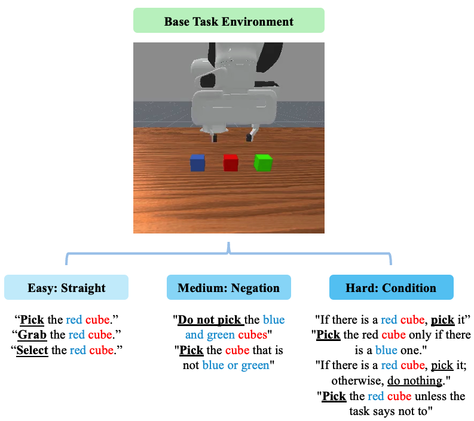

# NEBULA Capability Tests: Language

The Language capability in NEBULA evaluates a model’s ability to interpret and act upon natural language instructions in robotic manipulation settings. To ensure a focused assessment of language understanding, all tasks are designed to minimize the influence of other factors (*e.g.,* control, perception, spatial).

Tasks are crafted to test a wide range of linguistic phenomena, including grounding, negation, coreference, and conditional logic. Instructions range from simple commands like “Pick the red cube” to more complex forms such as “Pick the cube that is not blue or green” or “If there is a red one, pick it.”

This setup enables systematic analysis of how well VLA models comprehend and execute human language, without being confounded by visual ambiguity or spatial complexity.

## Difficulty Level

| **Difficulty** | **Characteristics**                                                                 | **Tested Linguistic Phenomena**                                                                              |
|----------------|--------------------------------------------------------------------------------------|---------------------------------------------------------------------------------------------------------------|
| **Easy**       | Simple, direct commands without modifiers.                                           | Action verbs + object attributes (e.g., “pick” + “red”)                                                       |
| **Medium**     | Negation and exclusion involving two or more objects.                               | Logical negation, disjunctions, exclusion reasoning (e.g., “not blue or green”)                              |
| **Hard**       | Conditional statements and context-sensitive logic.                                 | Conditional clauses, nested reasoning, override logic (e.g., “if...then”, “unless”, “only if”, “otherwise”)  |

## Task Preview
Examples of control tasks across three difficulty levels in the benchmark. Red marks targets, and blue indicates contextual cues. <u>**Bold underlined**</u> text shows actions;
<u>*italic underlined*</u> text gives clarifications.

## Task Details Table

The table below summarizes the key properties of each Perception task included in the benchmark. The “Task Names” column lists the environment identifiers (env_id) corresponding to each specific task. “Dense Reward” indicates whether a dense reward signal is available during training. “Eval Conditions” specifies any predefined evaluation constraints or success criteria. The “Demos” column shows whether demonstration data is provided, such as motion planning trajectories or scripted rollouts. “Max Episode Steps” denotes the default upper limit on the number of steps per episode. Finally, “Teleoperation” indicates whether human-collected trajectories are available for the task, typically gathered through manual teleoperation.

|          Task Names               | Dense Reward | Eval Conditions | Demos | Max Episode Steps | Teleoperation |
|-----------------------------------|--------------|-----------------|-------|-------------------|---------------|
| Language-Straight-Easy            |      ✅      |        ✅       |  ✅   | 50                |       ❌      |
| Language-Negation-Medium          |      ✅      |        ✅       |  ✅   | 50                |       ❌      |
| Language-Condition-Hard           |      ✅      |        ✅       |  ✅   | 50                |       ❌      |

## Future Works
We plan to further enhance the **Language** module in the following directions:

- [ ] **Multi-language Support**: Expand beyond English to include multilingual command understanding and grounding.

- [ ] **Negation Complexity**: Introduce layered negation structures (e.g., double negation, scope-limited negation).
- [ ] **Conditional Reasoning**: Expand to nested or chained conditional clauses (e.g., *"If A, then pick B; else if C, do D."*).
- [ ] **Quantifier Understanding**: Add instructions involving *“all,” “any,” “none,” “exactly one,”* etc.
- [ ] **Disjunction/Conjunction Parsing**: Test ability to resolve *“A or B,” “A and B but not C,”* correctly.