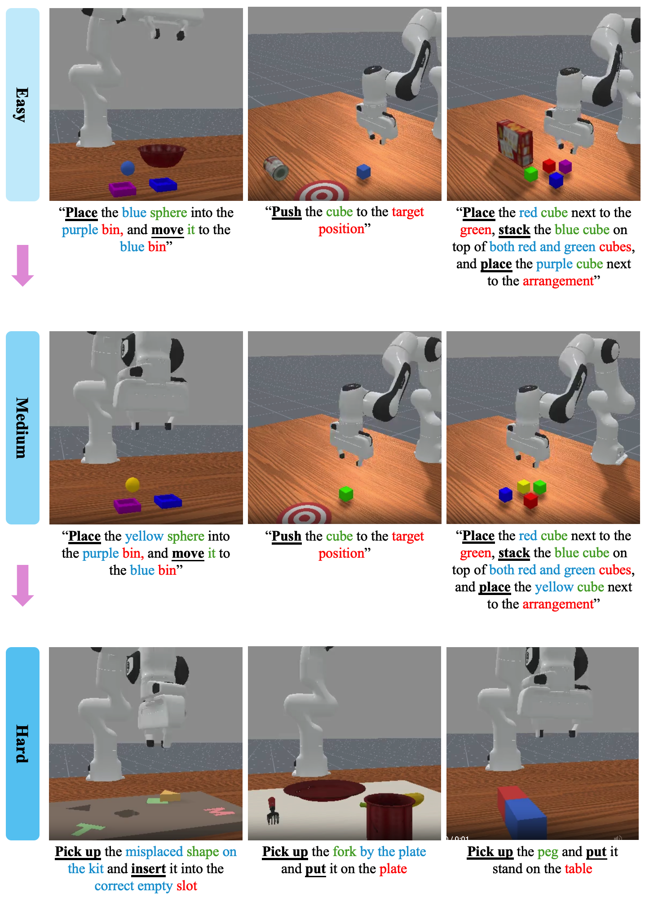

# NEBULA Capability Tests: Robustness / Generalization

The Robustness / Generalization capability in NEBULA evaluates an agent’s ability to perform reliably across diverse, unseen conditions. Tasks in this category are intentionally designed to expose the agent to variations it has not encountered during training. Unlike tasks that reward memorization or overfitting to specific settings, robustness tasks emphasize consistent performance under perturbations, while generalization tasks assess the transferability of learned behaviors to novel scenarios. This capability is essential for deploying embodied AI systems in the real world, where unpredictable changes and domain shifts are inevitable.

## Difficulty Level

| Difficulty | Description                                                                 |
|------------|-----------------------------------------------------------------------------|
| Easy       | Similar scenes with minor variations in object attributes (*e.g.,* color or shape changes) |
| Medium     | Introduction of unseen distractor objects that were not present during training |
| Hard       | Completely new scenes and task configurations requiring full generalization |

## Task Preview
Examples of Perception tasks across three difficulty levels in the benchmark. Red marks targets and blue indicates contextual cues. <u>**Bold underlined**</u> text shows actions; <u>*italic underlined*</u> text gives clarifications.

## Task Details Table

The table below summarizes the key properties of each Perception task included in the benchmark. The “Task Names” column lists the environment identifiers (env_id) corresponding to each specific task. “Dense Reward” indicates whether a dense reward signal is available during training. “Eval Conditions” specifies any predefined evaluation constraints or success criteria. The “Demos” column shows whether demonstration data is provided, such as motion planning trajectories or scripted rollouts. “Max Episode Steps” denotes the default upper limit on the number of steps per episode. Finally, “Teleoperation” indicates whether human-collected trajectories are available for the task, typically gathered through manual teleoperation.

|          Task Names               | Dense Reward | Eval Conditions | Demos | Max Episode Steps | Teleoperation |
|-----------------------------------|--------------|-----------------|-------|-------------------|---------------|
| Robust-PlaceSphere-Easy           |      ✅      |        ✅        |  ❌   | 50                |       ❌      |
| Robust-PushCube-Easy              |      ✅      |        ✅        |  ❌   | 50                |       ❌      |
| Robust-StackCube-Easy             |      ✅      |        ✅        |  ❌   | 250               |       ❌      |
| Robust-PlaceSphere-Medium         |      ✅      |        ✅        |  ❌   | 50                |       ❌      |
| Robust-PushCube-Medium            |      ✅      |        ✅        |  ❌   | 50                |       ❌      |
| Robust-StackCube-Medium           |      ✅      |        ✅        |  ❌   | 250               |       ❌      |
| Robust-AssemblingKits-Hard        |      ✅      |        ✅        |  ❌   | 200               |       ❌      |
| Robust-KitchenAssembly-Hard       |      ✅      |        ✅        |  ❌   | 200               |       ❌      |
| Robust-LiftPegUpright-Hard        |      ✅      |        ✅        |  ❌   | 50                |       ❌      |

>**Note:** Since the goal of the **Robustness / Generalization** capability is to evaluate a model’s resilience and adaptability to unseen conditions, we intentionally **do not provide training data** for this category. All tasks are designed exclusively for **testing purposes** to ensure fair comparison and to fully preserve the intended challenge of generalization. Researchers are **strongly discouraged** from using these scenes for fine-tuning or training, as doing so would compromise the benchmark’s integrity and defeat its purpose of measuring out-of-distribution robustness.